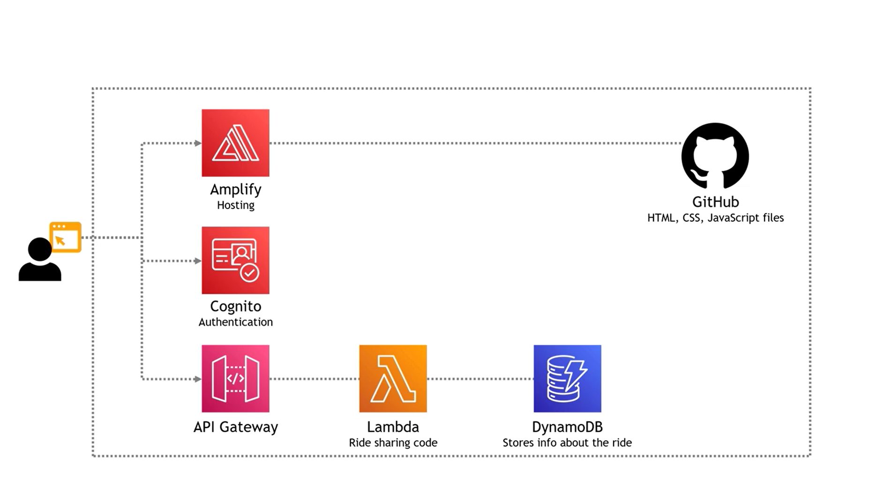
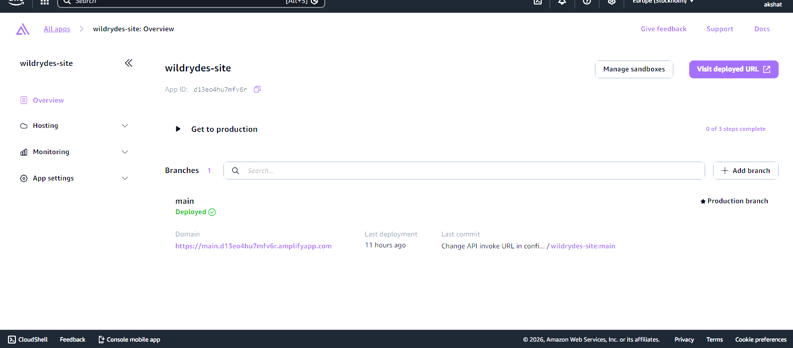
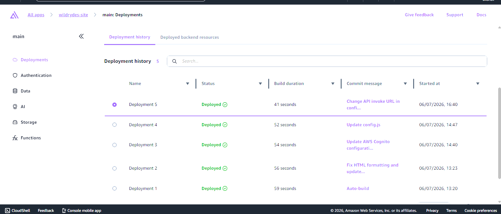
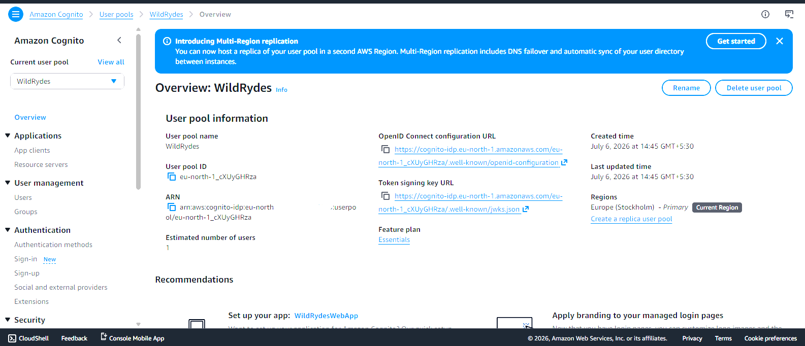
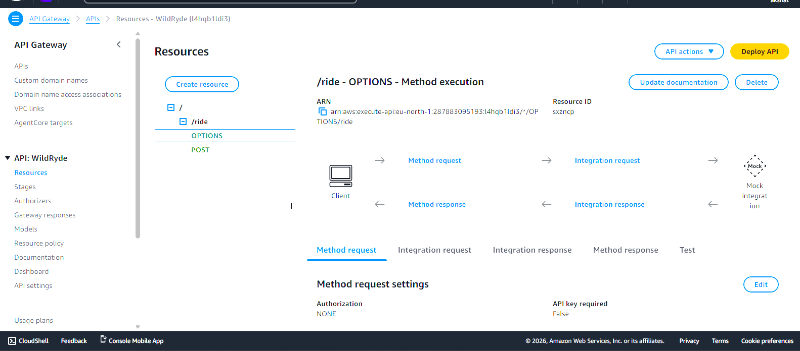
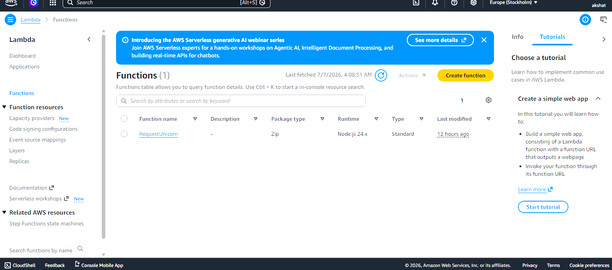
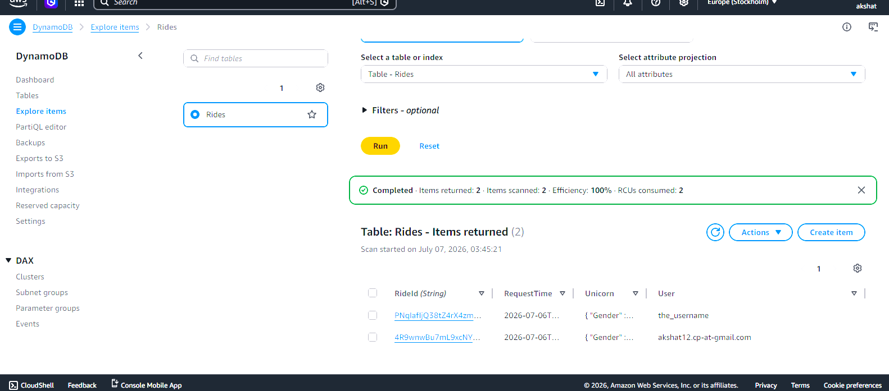
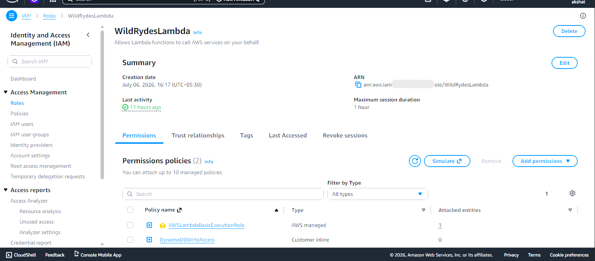
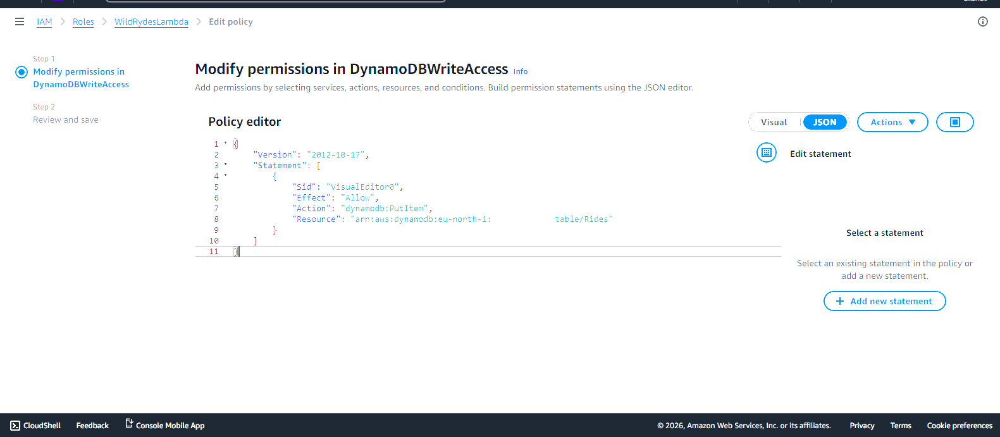
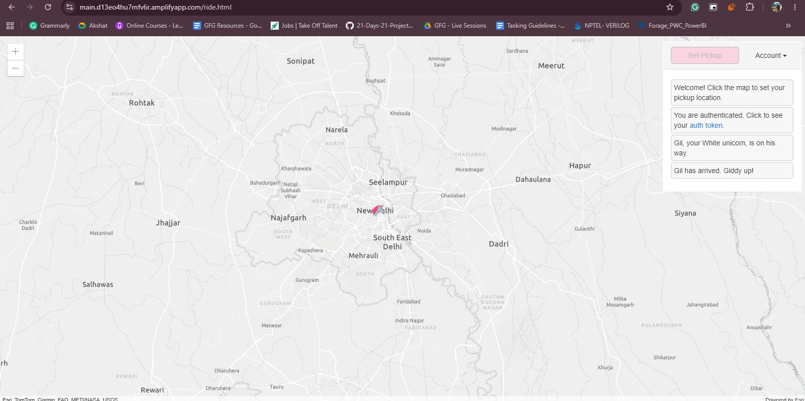

# AWS Project - Serverless Wild Rydes Web App - Build a Full End-to-End Web Application

## TL;DR
This project demonstrates the deployment of a serverless web application on AWS. The frontend is hosted using AWS Amplify, authentication is handled through Amazon Cognito, API requests are routed through Amazon API Gateway, backend logic is executed using AWS Lambda, and ride request information is stored in Amazon DynamoDB, with code stored in GitHub and incorporated into a CI/CD pipeline with Amplify.
We're creating a web application for a unicorn ride-sharing service called Wild Rydes (from the original [Amazon workshop](https://aws.amazon.com/serverless-workshops)).

The app will let you create an account and log in, then request a ride by clicking on a map (powered by ArcGIS).  The code can also be extended to build out more functionality.

## Architecture
This project follows a fully serverless architecture on AWS, where the frontend is hosted using AWS Amplify, user authentication is managed by Amazon Cognito, API requests are handled by Amazon API Gateway, backend business logic is executed through AWS Lambda, and ride request data is stored in Amazon DynamoDB.




## AWS Services Used

| AWS Service | Purpose |
|--------------|---------|
| **AWS Amplify** | Hosted and deployed the frontend web application with continuous deployment from GitHub. |
| **Amazon Cognito** | Managed user authentication, registration, and authorization using User Pools. |
| **Amazon API Gateway** | Exposed REST APIs and routed incoming requests to AWS Lambda. |
| **AWS Lambda** | Executed serverless backend logic to process ride requests. |
| **Amazon DynamoDB** | Stored ride request data in a fully managed NoSQL database. |
| **AWS IAM** | Configured secure roles and permissions for communication between AWS services. |

## Cost
All services used are eligible for the [AWS Free Tier](https://aws.amazon.com/free/). Outside of the Free Tier, there may be small charges associated with building the app (less than $1 USD), but charges will continue to incur if you leave the app running. 
All AWS resources were deleted after successful implementation and testing to avoid ongoing cloud charges. This repository contains the complete source code and documentation required to reproduce the project.

## The Application Code
The application code is here in this repository.

## Features

- Hosted a static frontend application using **AWS Amplify**.
- Implemented secure user authentication with **Amazon Cognito**.
- Built a serverless backend using **AWS Lambda**.
- Exposed REST APIs through **Amazon API Gateway**.
- Stored ride request data in **Amazon DynamoDB**.
- Configured secure service-to-service access using **AWS IAM Roles**.
- Demonstrated an end-to-end serverless application architecture on AWS.

## Application

### Homepage


### Login


## AWS Deployment

### Amplify
AWS Amplify was used to host and deploy the frontend application. It provides continuous deployment from the GitHub repository, making it easy to publish updates and manage application hosting.



### Deployment History
The deployment history shows successful builds and deployments of the application, confirming that the frontend was successfully hosted and accessible through AWS Amplify.



---

## Amazon Cognito

Amazon Cognito was configured to provide secure user authentication. It manages user registration, sign-in, and token generation, allowing only authenticated users to access the application.



---

## Amazon API Gateway

Amazon API Gateway exposes a REST API that receives requests from the frontend application and securely routes them to the backend AWS Lambda function.



---
## AWS Lambda

AWS Lambda executes the backend business logic whenever a ride request is submitted. The function processes the incoming request and stores the ride information in Amazon DynamoDB.



### Lambda Trigger

The Lambda function is configured with Amazon API Gateway as its trigger, enabling serverless execution whenever the frontend invokes the REST API.


---

## Amazon DynamoDB

Amazon DynamoDB serves as the application's NoSQL database. It stores ride request information generated by authenticated users during application usage.



The table contains ride request records successfully written by the Lambda function, demonstrating end-to-end integration between the frontend, API Gateway, Lambda, and DynamoDB.

---

## IAM Roles

AWS Identity and Access Management (IAM) roles were configured to provide secure permissions between AWS services. These roles allow Lambda to access DynamoDB and enable other AWS services to interact securely without exposing credentials.





---

## Working Application

The application allows authenticated users to request a unicorn ride through the web interface. User authentication, API invocation, backend processing, and database storage are all handled using AWS serverless services.



## The Lambda Function Code
Here is the code for the Lambda function, originally taken from the [AWS workshop](https://aws.amazon.com/getting-started/hands-on/build-serverless-web-app-lambda-apigateway-s3-dynamodb-cognito/module-3/ ), and updated for Node 20.x (works for 24.x as well):

```node
import { randomBytes } from 'crypto';
import { DynamoDBClient } from '@aws-sdk/client-dynamodb';
import { DynamoDBDocumentClient, PutCommand } from '@aws-sdk/lib-dynamodb';

const client = new DynamoDBClient({});
const ddb = DynamoDBDocumentClient.from(client);

const fleet = [
    { Name: 'Angel', Color: 'White', Gender: 'Female' },
    { Name: 'Gil', Color: 'White', Gender: 'Male' },
    { Name: 'Rocinante', Color: 'Yellow', Gender: 'Female' },
];

export const handler = async (event, context) => {
    if (!event.requestContext.authorizer) {
        return errorResponse('Authorization not configured', context.awsRequestId);
    }

    const rideId = toUrlString(randomBytes(16));
    console.log('Received event (', rideId, '): ', event);

    const username = event.requestContext.authorizer.claims['cognito:username'];
    const requestBody = JSON.parse(event.body);
    const pickupLocation = requestBody.PickupLocation;

    const unicorn = findUnicorn(pickupLocation);

    try {
        await recordRide(rideId, username, unicorn);
        return {
            statusCode: 201,
            body: JSON.stringify({
                RideId: rideId,
                Unicorn: unicorn,
                Eta: '30 seconds',
                Rider: username,
            }),
            headers: {
                'Access-Control-Allow-Origin': '*',
            },
        };
    } catch (err) {
        console.error(err);
        return errorResponse(err.message, context.awsRequestId);
    }
};

function findUnicorn(pickupLocation) {
    console.log('Finding unicorn for ', pickupLocation.Latitude, ', ', pickupLocation.Longitude);
    return fleet[Math.floor(Math.random() * fleet.length)];
}

async function recordRide(rideId, username, unicorn) {
    const params = {
        TableName: 'Rides',
        Item: {
            RideId: rideId,
            User: username,
            Unicorn: unicorn,
            RequestTime: new Date().toISOString(),
        },
    };
    await ddb.send(new PutCommand(params));
}

function toUrlString(buffer) {
    return buffer.toString('base64')
        .replace(/\+/g, '-')
        .replace(/\//g, '_')
        .replace(/=/g, '');
}

function errorResponse(errorMessage, awsRequestId) {
    return {
        statusCode: 500,
        body: JSON.stringify({
            Error: errorMessage,
            Reference: awsRequestId,
        }),
        headers: {
            'Access-Control-Allow-Origin': '*',
        },
    };
}
```

## The Lambda Function Test Function
Here is the code used to test the Lambda function:

```json
{
    "path": "/ride",
    "httpMethod": "POST",
    "headers": {
        "Accept": "*/*",
        "Authorization": "eyJraWQiOiJLTzRVMWZs",
        "content-type": "application/json; charset=UTF-8"
    },
    "queryStringParameters": null,
    "pathParameters": null,
    "requestContext": {
        "authorizer": {
            "claims": {
                "cognito:username": "the_username"
            }
        }
    },
    "body": "{\"PickupLocation\":{\"Latitude\":47.6174755835663,\"Longitude\":-122.28837066650185}}"
}
```
---
## Project Learnings

During this project, I gained practical experience with several core AWS services and serverless application development concepts, including:

- Designing and deploying a complete serverless application on AWS.
- Hosting and managing frontend applications using AWS Amplify.
- Implementing secure authentication using Amazon Cognito User Pools.
- Building REST APIs with Amazon API Gateway.
- Developing event-driven backend functions using AWS Lambda.
- Working with Amazon DynamoDB for NoSQL data storage.
- Configuring IAM Roles and permissions following AWS security best practices.
- Understanding the request flow between frontend, authentication, API, compute, and database services.
- Troubleshooting deployment, authentication, and permission-related issues in AWS.

---

## Future Improvements

Potential enhancements for this project include:

- Implement Infrastructure as Code (IaC) using AWS CloudFormation or Terraform.
- Automate deployment using GitHub Actions CI/CD pipelines.
- Configure a custom domain with HTTPS using Amazon Route 53 and AWS Certificate Manager.
- Add CloudWatch dashboards, alarms, and centralized monitoring.
- Integrate Amazon S3 for storing application assets and logs.
- Enhance security using AWS WAF and fine-grained IAM policies.
- Extend the application with additional APIs and user features.
- Improve scalability by implementing advanced monitoring and performance optimization.
